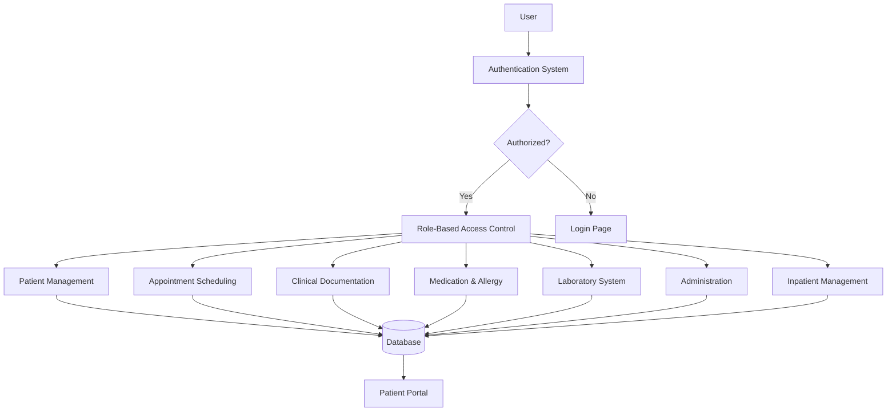
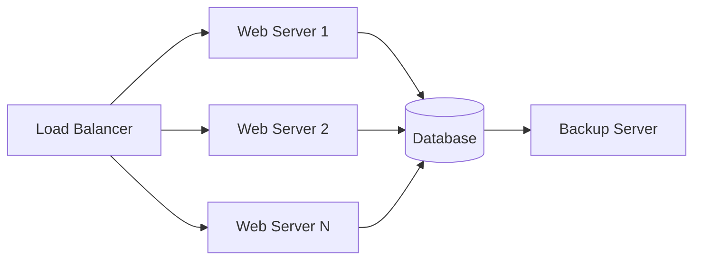

# EHR System Architecture

## Technology Stack

### Backend
- **Framework**: Flask (Python)
- **Database**: PostgreSQL
- **ORM**: SQLAlchemy
- **Authentication**: Flask-Login, Flask-JWT for API
- **Authorization**: Custom RBAC implementation
- **API Versioning**: URL prefixing (/api/v1/)
- **Testing**: pytest

### Frontend
- **Templates**: Jinja2
- **CSS Framework**: Bootstrap 5
- **JavaScript**: Vanilla JS with some libraries (e.g., FullCalendar.js)
- **Patient Portal**: Separate authentication system

### Development Tools
- **Virtual Environment**: venv
- **Database Migrations**: Flask-Migrate
- **Code Quality**: flake8, black
- **Documentation**: Sphinx

## System Components

### 1. Authentication & Authorization System
- User registration and login
- Role-based access control (RBAC)
- Session management
- Password hashing (bcrypt)
- Patient portal authentication (separate from staff)

### 2. Core Modules

#### a. Patient Management
- Patient registration
- Patient search
- Patient profile view
- Demographics management

#### b. Appointment Scheduling
- Appointment booking
- Calendar view
- Rescheduling and cancellation
- Doctor schedule management

#### c. Clinical Documentation
- Vital signs recording
- Clinical notes
- Encounter history

#### d. Medication & Allergy Management
- Allergy recording
- Medication prescribing
- Medication history

#### e. Laboratory System
- Lab order creation
- Lab result entry
- Lab result viewing

#### f. Administration
- Role management
- System parameter management
- User role assignment

#### g. Patient Portal
- Patient authentication
- Health profile viewing
- Appointment viewing
- Lab results viewing

#### h. Inpatient Management (ADT)
- Patient admission
- Bed management
- Patient transfer
- Patient discharge

## Database Design

### Core Entities

#### User Management
- `User`: id (UUID), username, email, password_hash, first_name, last_name, created_at, updated_at, created_by, updated_by, additional_data (JSONB)
- `Role`: id, name, description, created_at, updated_at, created_by, updated_by, additional_data (JSONB)
- `UserRole`: user_id (UUID), role_id (UUID) (many-to-many relationship)

#### Patient Management
- `Patient`: id (UUID), first_name, last_name, date_of_birth, gender, address, phone, email, created_at, updated_at, created_by, updated_by, additional_data (JSONB)

#### Clinical Data
- `VitalSigns`: id (UUID), patient_id, recorded_by, date, bp_systolic, bp_diastolic, heart_rate, temperature, weight, height, created_at, updated_at, created_by, updated_by, additional_data (JSONB)
- `ClinicalNote`: id (UUID), patient_id, written_by, date, note_type, content, created_at, updated_at, created_by, updated_by, additional_data (JSONB)

#### Medication & Allergy
- `Allergy`: id (UUID), patient_id, allergen, reaction, severity, recorded_date, created_at, updated_at, created_by, updated_by, additional_data (JSONB)
- `Medication`: id (UUID), patient_id, prescribed_by, drug_name, dosage, frequency, start_date, end_date, status, created_at, updated_at, created_by, updated_by, additional_data (JSONB)

#### Laboratory
- `LabOrder`: id (UUID), patient_id, ordered_by, test_type, order_date, status, created_at, updated_at, created_by, updated_by, additional_data (JSONB)
- `LabResult`: id (UUID), order_id, performed_by, result_data, result_date, created_at, updated_at, created_by, updated_by, additional_data (JSONB)

#### Appointments
- `Appointment`: id (UUID), patient_id, doctor_id, room_id, scheduled_time, duration, status, notes, created_at, updated_at, created_by, updated_by, additional_data (JSONB)

#### Administration
- `Hospital`: id (UUID), name, address, contact_info, created_at, updated_at, created_by, updated_by, additional_data (JSONB)
- `Clinic`: id (UUID), hospital_id, name, description, created_at, updated_at, created_by, updated_by, additional_data (JSONB)
- `Ward`: id (UUID), hospital_id, name, description, created_at, updated_at, created_by, updated_by, additional_data (JSONB)
- `RoomClass`: id (UUID), name, description, num_beds, created_at, updated_at, created_by, updated_by, additional_data (JSONB)
- `Room`: id (UUID), clinic_id, room_number, name, created_at, updated_at, created_by, updated_by, additional_data (JSONB)
- `WardRoom`: id (UUID), ward_id, room_class_id, room_number, created_at, updated_at, created_by, updated_by, additional_data (JSONB)
- `Bed`: id (UUID), ward_room_id, bed_number, status, created_at, updated_at, created_by, updated_by, additional_data (JSONB)
- `DoctorProfile`: id (UUID), user_id, specialization, license_number, created_at, updated_at, created_by, updated_by, additional_data (JSONB)
- `DoctorSchedule`: id (UUID), doctor_id, day_of_week, start_time, end_time, created_at, updated_at, created_by, updated_by, additional_data (JSONB)

#### Inpatient Management
- `Admission`: id (UUID), patient_id, bed_id, admitted_by, admission_date, discharge_date, status, created_at, updated_at, created_by, updated_by, additional_data (JSONB)

## Data Flow Diagram

## API Design (v1)

### Authentication
- POST /api/v1/auth/login
- POST /api/v1/auth/logout
- POST /api/v1/auth/register (patient only)

### Patient Management
- GET /api/v1/patients
- POST /api/v1/patients
- GET /api/v1/patients/{id}
- PUT /api/v1/patients/{id}
- DELETE /api/v1/patients/{id}

### Appointments
- GET /api/v1/appointments
- POST /api/v1/appointments
- GET /api/v1/appointments/{id}
- PUT /api/v1/appointments/{id}
- DELETE /api/v1/appointments/{id}

### Clinical Data
- GET /api/v1/patients/{id}/vitals
- POST /api/v1/patients/{id}/vitals
- GET /api/v1/patients/{id}/notes
- POST /api/v1/patients/{id}/notes

## Security Considerations

1. All passwords hashed with bcrypt
2. Role-based access control enforced at route level
3. Input validation and sanitization
4. CSRF protection for forms
5. Secure headers implementation
6. Rate limiting for authentication endpoints
7. Database connection pooling
8. Regular security audits

## Deployment Architecture

## Testing Strategy

1. Unit tests for all models and utility functions
2. Integration tests for API endpoints
3. UI tests for critical user flows
4. Security scanning
5. Performance testing
6. Database migration testing

## Future Enhancements

1. Clinical Decision Support System
2. Reporting and Analytics Module
3. Telemedicine Integration
4. Billing and Insurance Module
5. FHIR API Implementation
6. Mobile Application Development